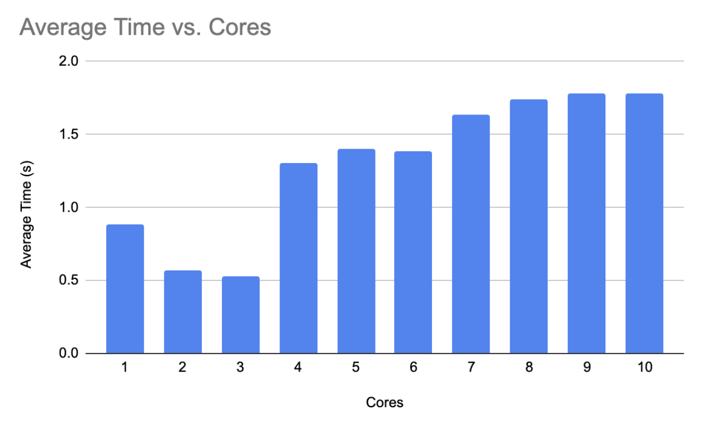
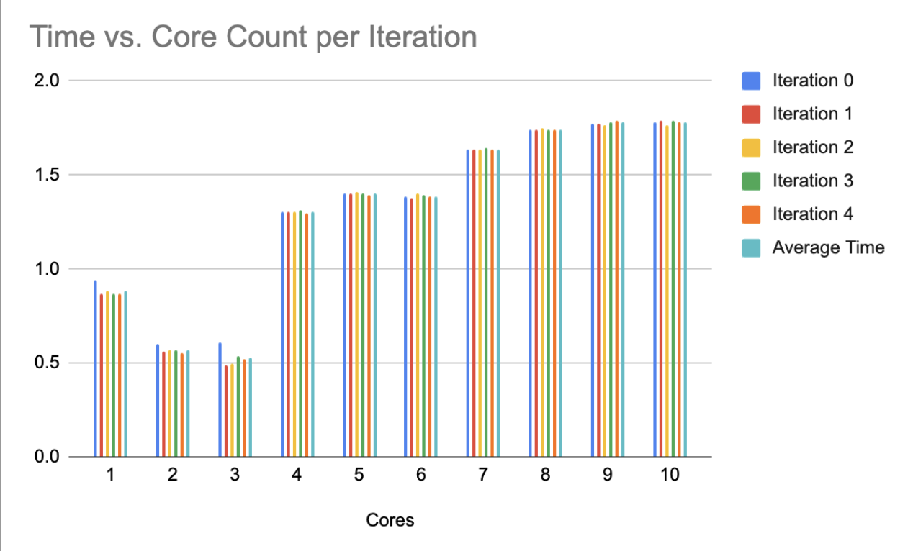
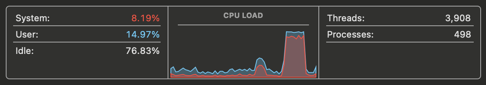

# Parallel Reading Experiment

The code in this repository mostly serves as an experiment to take a look at parallel reading from a
file across CPU cores.

I was intrigued by a question I was asked, and wanted to run an experiment on the benefit of doing such reads, as
my previous experience with data processing was on compressed files that were difficult to read in parallel, such as bz2.

## Approach & Implementation

My approach is relatively straightforward. For the most part, I read from the same using varying number of cores,
and repeat this a given number of times for each core count to get an average of how long a workload
takes given a certain number of cores.

For the metrics below, I read the file 5 times for a given number of cores that I wanted to test. My
computer has 10 cores, for reference.

I additionally utiilized the 'multiprocessing' module for true parallelization, as the python GIL prevents
'true' multithreading, and I just wanted to spin up a quick POC.

## Results & Metrics

Below, I will present graphs showing the average time of reading the file, as well as the actual
times from each iteration.

I have additionally added on a graph tracking the CPU utilization as well (coming from the Activity Monitor
app available on my laptop).

[Spreadsheet link here!](https://docs.google.com/spreadsheets/d/1RppXfnqSIislLZfEpFmC9uiIDoP2APN4XNwJMD8iBNM/edit?usp=sharing)

### Average Time per Core Utilized

### Results for each iteration

### CPU Utilization

## Reflections

One thing that I found extremely interesting, is that despite the common heuristic that more cpu utilization is good,
I found that the run which (on average) performed the best in time didn't necessarily have the best utilization
of the CPU. Below, I have attached an image comparing the CPU utilization of the 3-core run compared to that of
the 10-core run.

Based on my current understanding of storage devices, I would likely say that this is largely due to the
interleaving of I/O requests. I wonder how much of this is tied to the fact that my laptop uses an SSD, however I hope to update this README once I get access to a computer with a Hard Drive soon. However, I would expect a much larger dropoff in performance due to how
interleaved I/O requests might increase seek time, given that flash memory doesn't suffer from the same problem.

Overall, the main conclusion I drew from this is that parallelizing sequential reads across cores can be
beneficial to a point, which of course would depend on the hardware a program is running on.

## Running

To run this program, you would simply need to change the `dataset_path` variable
to the path of the file you want to test this on.

